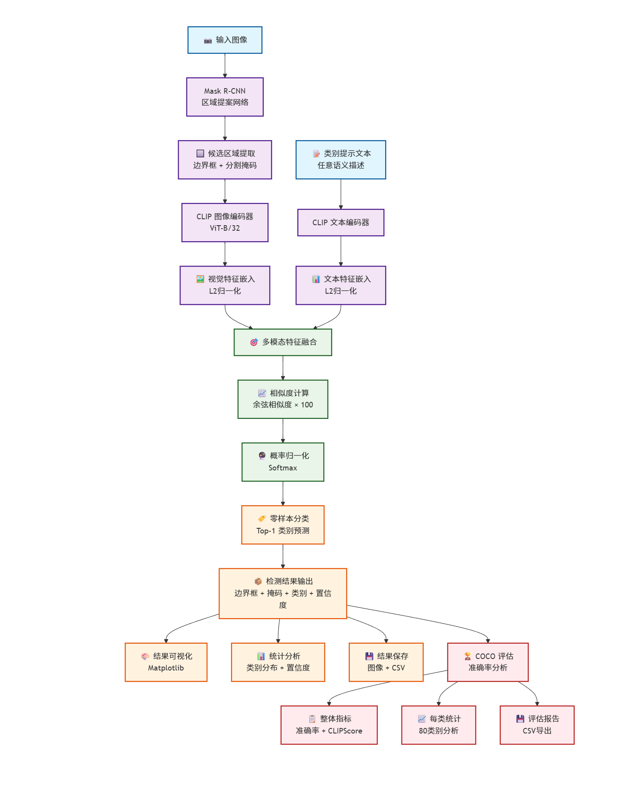
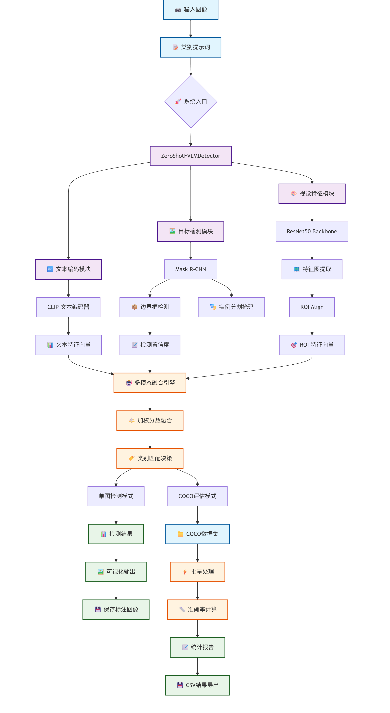

# zero-shot-open-vocabulary-deceter（clip模型以及mask-rcnn创建）

## 项目概述

本项目实现了一个零样本开放词汇目标检测器，能够在不依赖特定类别训练数据的情况下，检测和分类任意类别的物体。通过结合 Mask R-CNN 的区域提案能力（保留区域建议和分割掩码的能力，不使用原始标准分类头）和 CLIP 的零样本分类能力，该系统实现了对自然语言描述物体的灵活识别。

## *前言*

根据考核内容（利用clip模型和mask-rcnn模型制作zero-shot open vocabulary detector并将f-vlm的理念应用其中）， 总共分成了四个部分：

1.（clip-mask-rcnn.py)：单纯使用clip模型和mask-rcnn模型制作的检测器鉴别图片。

2.（clip-evaluate.py） coco数据集测试检测器的clipscore和每个类别的准确性

3.（F-vlm.py) 应用f-vlm理念配合clip和mask-rcnn模型制作的检测器鉴别图片（实际效果并不理想）

4.（F-vlm-evaluate.py)同样coco数据集测试检测器的clipscore和每个类别的准确性。

## 环境配置
采用Anaconda创建的虚拟环境运行该实践
Python 3.11.13

Pytorch 2.7.0

Clip模型：ViT-B/32

Mask-rcnn:COCO-InstanceSegmentation/mask_rcnn_R_50_FPN_3x.yaml

COCO数据集：val2017（5000张测评图片）

## 依赖安装
**检查Python版本**

    python --version

 **安装基础包**

    pip install torch torchvision torchaudio
    pip install opencv-python pillow matplotlib pandas tqdm

**安装CLIP**

    pip install git+https://github.com/openai/CLIP.git

 **安装Detectron2**

    pip install 'git+https://github.com/facebookresearch/detectron2.git'

**安装COCO工具**

    pip install pycocotools

下载coco数据集和annotation文件
https://cocodataset.org/#download

## 系统架构图
clip-maskrcnn制作检测器架构图
融入F-vlm理念的检测器的架构图

## 测评图演示
原图：
测评图：

## 核心函数说明
| 函数名称 | 功能描述 | 输入参数 | 输出结果 |
|----------|----------|----------|----------|
| `__init__()` | 初始化检测器模型，加载 CLIP、Mask R-CNN 和 ResNet50 等组件 | 模型配置路径、设备类型、参数设置 | 初始化完成的检测器实例 |
| `precompute_text_embeddings()` | 预计算文本特征向量，将类别提示词编码为语义嵌入 | 类别提示词列表（如：`["a photo of a cat", ...]`） | 归一化的文本特征张量 |
| `extract_roi_embeddings()` | 提取视觉区域特征，对检测到的 ROI 进行特征编码 | 图像区域边界框、特征图、图像尺寸 | 区域视觉特征向量 |
| `classify_with_clip()` | 零样本分类，计算视觉特征与文本特征的相似度 | 视觉特征向量、文本特征向量 | 类别概率分布和置信度分数 |
| `detect()` | 主检测流程，协调整个检测流水线 | 输入图像路径、类别提示词列表 | 检测结果（边界框、类别、置信度等） |
| `visualize()` | 结果可视化，在图像上绘制检测框和标签 | 原始图像、检测结果数据 | 标注完成的输出图像文件 |
| `evaluate_on_coco()` | 性能评估，在 COCO 数据集上测试模型准确率 | COCO 数据集路径、评估配置 | 准确率指标和统计报告 |

## 检测结果和clipcore

| 指标 | ）f-vlm-evaluate | clip-evaluate（不用使用f-vlm理念） |
|------|--------|--------|
| Total GT objects | 36,781 | 36,781 |
| Overall Accuracy | 0.2760 | 0.2936 |
| Average CLIPScore (RoI-level) | 0.8547 | 0.8506 |
综合分析：CLIP 与 Mask R-CNN 相结合的方式，通过 CLIP 的文本嵌入与 ROI 特征计算相似度进行分类。结果显示：
-   Overall Accuracy = 0.2760，说明模型在零样本类别的检测精度有限，仅约 27.6% 的检测结果与真实标注匹配；
-   Average CLIPScore = 0.8547，表明检测到的区域在语义空间中与文本提示保持了较高的一致性。
-   
    整体而言，该方法能够实现开放词汇检测，但特征对齐能力不足，导致检测准确率偏低。
    
引入 **F-VLM** 思想之后，即利用视觉大模型特征增强 Mask R-CNN 的 ROI 表征，并与 CLIP 文本特征融合，从而提升跨模态对齐能力。结果显示：

-   ****Overall Accuracy = 0.2936****，相比实验一提升了约 1.76 个百分点，说明 F-VLM 融合能够有效提高类别判别的准确性
-   ****Average CLIPScore = 0.8506****，略低于实验一（下降 0.0041），表明在优化检测任务时，模型调整了特征分布，牺牲了一部分与原始 CLIP 表征的一致性。

关于coco数据集八十个类别的检测保存在csv文件中（coco_per_class_accuracy.csv）
1.  **整体表现**
    
    - 在 80 个 COCO 类别上，很多类别准确率达到 0.5–0.9 以上（例如 elephant、zebra、giraffe、tennis racket 等接近甚至超过 0.9）
    -   即使是小物体（如 frisbee, skateboard, surfboard）或细长物体（kite, skis）也表现不错，准确率保持在 0.5–0.7。
    -   但对一些类别（如 fork, knife, spoon, bottle, chair）准确率较低（0.01–0.15），表明 CLIP 在这些物体的细粒度识别上能力不足。
2.  **类别分布影响**
    -   COCO 数据集中常见的大动物（cow, elephant, zebra, giraffe）和交通工具（bus, train, airplane）检测表现最佳
    -   而小型日常物品（遥控器、键盘、牙刷等）准确率很差，CLIP 语义特征在这些长尾类别上的泛化能力有限。
## 结语
本项目制作的Zero-Shot Open-Vocabulary Detector因为本人能力有限，还有许多需要改进的地方，首先是划分的区域虽然能够和文本提示保持较高的语义一致性，但是在coco数据集上表现的准确率较低，特别是一些小的物体几乎没有检测能力。还需要深入理解这些多模态相关的模型，增强解决问题和优化项目的能力，提升检测器的预测准确性是之后主要的目标，感谢阅览！

